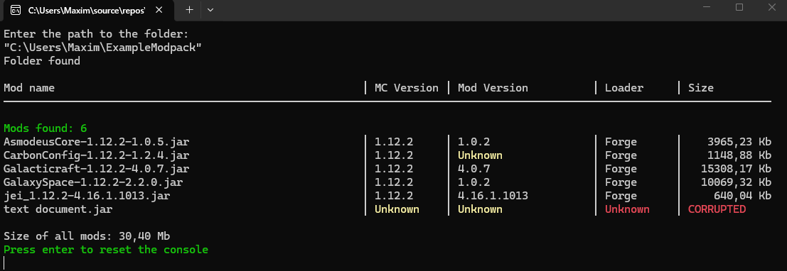

# Minecraft Mod Metadata Parser


This is a C# console tool designed to read files in .jar format and parse metadata files in it (JSON).

## Preview



## Features

* **Folder inspection**: Automatically scans a directory for `.jar` files.
* **Optimized Zip extraction**: Reads metadata files (`fabric.mod.json`, `mcmod.info`) without extracting archives to disk.
* **Multi-Loader support**: Reads mod metadata across loaders (Fabric & Forge).
* **Aligned console UI**: Outputs mod name, Minecraft version, mod version, loader, and file size in a formatted table with color-coded status badges.
* **Error handling**: Safely handles corrupted files, non-mod archives, or missing attributes without crashing.
* **Clean terminal UX**: Real-time processing status and structured output.

## Tech Stack & Libraries

* **Language**: C# (.NET 8)
* **Libraries**:
  * `System.IO.Compression` – Stream-based Zip archive parsing for `.jar` files.
  * `Newtonsoft.Json` – Deserialization and handling of dynamic JSON structures.
* **Tool**: Visual Studio

## Getting Started

### Prerequisites

* [.NET 8.0 SDK](https://dotnet.microsoft.com/download) or higher installed.

### Installation & Run

1. **Clone the repository:**

```bash
git clone https://github.com/Maxim-P128/MC-metadata-parser.git
```
```bash
cd MC-metadata-parser
```
2. **Run the project:**

```bash
dotnet run
```
## Kurzinfo für Arbeitgeber / Ausbilder

Dies ist ein persönliches C#-Projekt zur Analyse von Minecraft-Mod-Dateien.

* **Kernfunktion:** Auslesen von `.jar`-Dateien mittels In-Memory-Zip-Streams und Parsing von JSON-Metadaten.
* **Gelernt:** Umgang mit C#, Stream-Processing, Fehlerbehandlung (`try-catch`), Git-Versionskontrolle
